# ROAD2AIR — SAAB Airbase Simulation Developer Guide

A phase-based turn simulation of Swedish Air Force base operations. Players manage aircraft allocation, maintenance, resources, and mission scheduling across a 7-day campaign escalating from peacetime (FRED) through crisis (KRIS) to full warfare (KRIG).

---

## Table of Contents

1. [Getting Started](#1-getting-started)
2. [Architecture Overview](#2-architecture-overview)
3. [Type System](#3-type-system)
4. [Game Engine](#4-game-engine)
5. [14-Phase Turn Sequence](#5-14-phase-turn-sequence)
6. [Stochastics & Dice Tables](#6-stochastics--dice-tables)
7. [Recommendation Engine](#7-recommendation-engine)
8. [Configuration Data](#8-configuration-data)
9. [Initial Game State & Scenario](#9-initial-game-state--scenario)
10. [State Management & Hooks](#10-state-management--hooks)
11. [Pages & Routing](#11-pages--routing)
12. [Component Reference](#12-component-reference)
13. [Design System](#13-design-system)
14. [Domain Concepts](#14-domain-concepts)
15. [How-To Guides](#15-how-to-guides)
16. [File Map](#16-file-map)

---

## 1. Getting Started

### Tech Stack

| Layer | Technology |
|-------|-----------|
| Framework | React 18 + TypeScript 5.8 |
| Build | Vite 5 with SWC |
| Styling | Tailwind CSS 3.4 + shadcn/ui (Radix) |
| State | useReducer + React Context |
| Routing | React Router 6 |
| Animation | Framer Motion |
| Icons | Lucide React |
| Toasts | Sonner |

### Setup

```bash
pnpm install
pnpm dev          # Dev server on port 8080
pnpm build        # Production build
pnpm test         # Vitest with jsdom
pnpm exec tsc --noEmit  # Type check
```

### Path Alias

`@/*` resolves to `./src/*` (configured in `tsconfig.json` and `vite.config.ts`).

---

## 2. Architecture Overview

### Data Flow

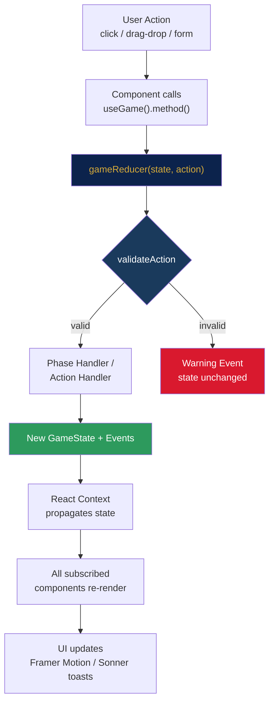

### Provider Hierarchy

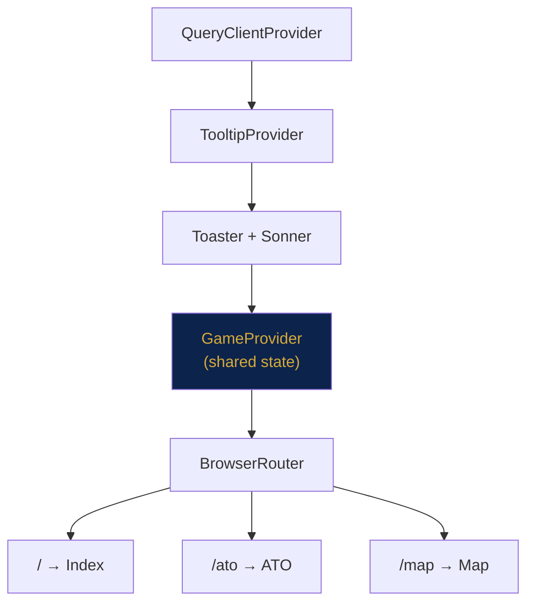

### Key Architectural Decisions

- **Pure reducer**: All game logic in `src/core/engine.ts` is a pure function. No side effects, no async. This makes it testable and replayable.
- **Single shared state**: A `GameProvider` wraps the entire app. All pages read from the same state instance — no state drift between pages.
- **Config-driven**: Probabilities, durations, capacities, and phase definitions live in `src/data/config/`. Tuning the simulation means editing config, not engine code.
- **9-state aircraft lifecycle**: Aircraft move through 9 discrete states rather than the common 4-state model, enabling granular simulation of prep, launch, recovery, and maintenance.

---

## 3. Type System

All types live in `src/types/game.ts`.

### Enums

```typescript
type BaseType = "MOB" | "FOB_N" | "FOB_S" | "ROB_N" | "ROB_S" | "ROB_E"
type AircraftType = "GripenE" | "GripenF_EA" | "GlobalEye" | "VLO_UCAV" | "LOTUS"
type MissionType = "DCA" | "QRA" | "RECCE" | "AEW" | "AI_DT" | "AI_ST" | "ESCORT" | "TRANSPORT"
type ScenarioPhase = "FRED" | "KRIS" | "KRIG"
type MaintenanceType = "quick_lru" | "complex_lru" | "direct_repair" | "troubleshooting" | "scheduled_service"
```

### Aircraft Status (9-State Model)

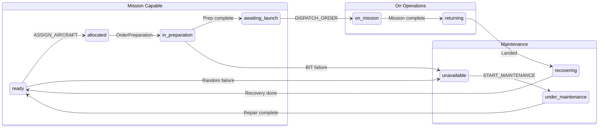

| Status | Meaning | MC? |
|--------|---------|-----|
| `ready` | Available for assignment | Yes |
| `allocated` | Assigned to ATO order | Counts as MC |
| `in_preparation` | Fuel, ammo, BIT in progress | Counts as MC |
| `awaiting_launch` | Prep done, waiting for go | Counts as MC |
| `on_mission` | Airborne / executing mission | No |
| `returning` | Flying back to base | No |
| `recovering` | Post-flight checks, refuel | No |
| `under_maintenance` | In bay, repair countdown | No |
| `unavailable` | Broken, waiting for bay | No |

**Helper functions**:
- `isMissionCapable(status)` — true only for `"ready"`
- `isInMaintenance(status)` — true for `"under_maintenance"` or `"unavailable"`
- `displayStatusCategory(status)` — maps 9 states to 4 display categories (`mc`, `on_mission`, `nmc`, `maintenance`)

### Core Interfaces

**GameState** — the root state object:
```typescript
interface GameState {
  day: number                      // 1-7
  hour: number                     // 6-23, wraps to 6 on next day
  phase: ScenarioPhase             // FRED/KRIS/KRIG (from scenario config)
  bases: Base[]                    // 3 active bases
  successfulMissions: number
  failedMissions: number
  events: GameEvent[]              // Rolling window of 50 events
  atoOrders: ATOOrder[]            // Today's mission orders
  turnPhase: TurnPhase             // Current phase in 14-step sequence
  turnNumber: number               // Increments each full cycle
  recommendations: Recommendation[]
  maintenanceTasks: MaintenanceTask[]
}
```

**Base**:
```typescript
interface Base {
  id: BaseType
  name: string                     // e.g. "Huvudbas MOB"
  type: "huvudbas" | "sidobas" | "reservbas"
  aircraft: Aircraft[]
  spareParts: SparePartStock[]
  personnel: PersonnelGroup[]
  fuel: number                     // 0-100 percentage
  maxFuel: number
  ammunition: { type: string; quantity: number; max: number }[]
  maintenanceBays: { total: number; occupied: number }
  zones: BaseZone[]                // Infrastructure zones
}
```

**Aircraft**:
```typescript
interface Aircraft {
  id: string
  type: AircraftType
  tailNumber: string
  status: AircraftStatus
  currentBase: BaseType
  flightHours: number
  hoursToService: number           // Countdown to 100h scheduled service
  currentMission?: MissionType
  payload?: string
  maintenanceTimeRemaining?: number
  maintenanceType?: MaintenanceType
  maintenanceTask?: MaintenanceTask
}
```

**ATOOrder**:
```typescript
interface ATOOrder {
  id: string
  day: number
  missionType: MissionType
  label: string                    // e.g. "Defensivt luftforsvar"
  startHour: number
  endHour: number
  requiredCount: number
  aircraftType?: AircraftType      // Optional type constraint
  payload?: string
  launchBase: BaseType
  priority: "high" | "medium" | "low"
  status: "pending" | "assigned" | "dispatched" | "completed"
  assignedAircraft: string[]       // Aircraft IDs
}
```

### Game Actions

All state mutations go through a discriminated union:

```typescript
type GameAction =
  | { type: "ADVANCE_PHASE" }
  | { type: "ASSIGN_AIRCRAFT"; orderId: string; aircraftIds: string[] }
  | { type: "DISPATCH_ORDER"; orderId: string }
  | { type: "START_MAINTENANCE"; baseId: BaseType; aircraftId: string }
  | { type: "SEND_MISSION_DROP"; baseId: BaseType; aircraftId: string; missionType: MissionType }
  | { type: "CREATE_ATO_ORDER"; order: ... }
  | { type: "EDIT_ATO_ORDER"; orderId: string; updates: ... }
  | { type: "DELETE_ATO_ORDER"; orderId: string }
  | { type: "APPLY_RECOMMENDATION"; recommendationId: string }
  | { type: "DISMISS_RECOMMENDATION"; recommendationId: string }
  | { type: "MOVE_AIRCRAFT"; aircraftId: string; fromZone: string; toZone: string; baseId: BaseType }
  | { type: "APPLY_UTFALL_OUTCOME"; baseId: BaseType; aircraftId: string; repairTime: number; maintenanceTypeKey: string; weaponLoss: number; actionLabel: string }
  | { type: "RESET_GAME" }
```

---

## 4. Game Engine

The engine lives in `src/core/` and is purely functional — no React, no side effects, no async.

### `src/core/engine.ts` — Main Reducer

```typescript
function gameReducer(state: GameState, action: GameAction): GameState
```

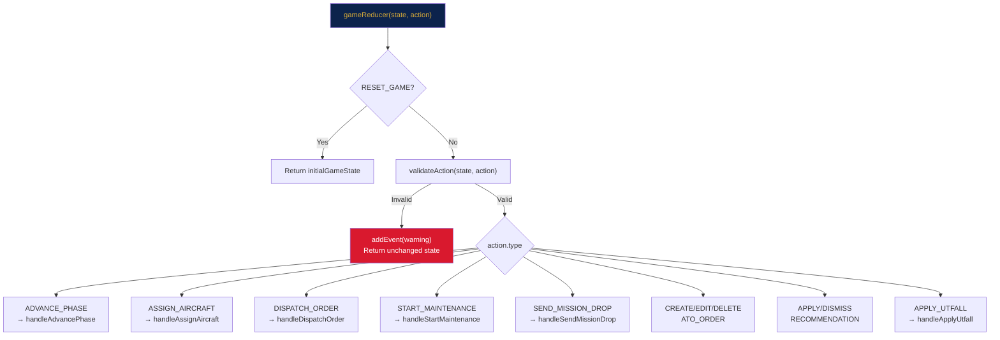

Flow:
1. `RESET_GAME` always returns `initialGameState`
2. `validateAction(state, action)` checks constraints
3. Invalid actions add a warning event and return unchanged state
4. Valid actions dispatch to handler functions

### `src/core/validators.ts` — Action Validation

```typescript
function validateAction(state: GameState, action: GameAction): { valid: boolean; reason?: string }
```

Most interactive actions (drag-drop, assign, dispatch, maintenance) are always allowed regardless of the current turn phase. Validation checks state constraints:

- `ASSIGN_AIRCRAFT`: order exists + not completed, aircraft is MC at launch base
- `DISPATCH_ORDER`: order has assigned aircraft
- `START_MAINTENANCE`: aircraft is `unavailable`, bays not full
- `SEND_MISSION_DROP`: aircraft is mission-capable
- `DELETE_ATO_ORDER`: order not already dispatched

### Auto-Advance Logic

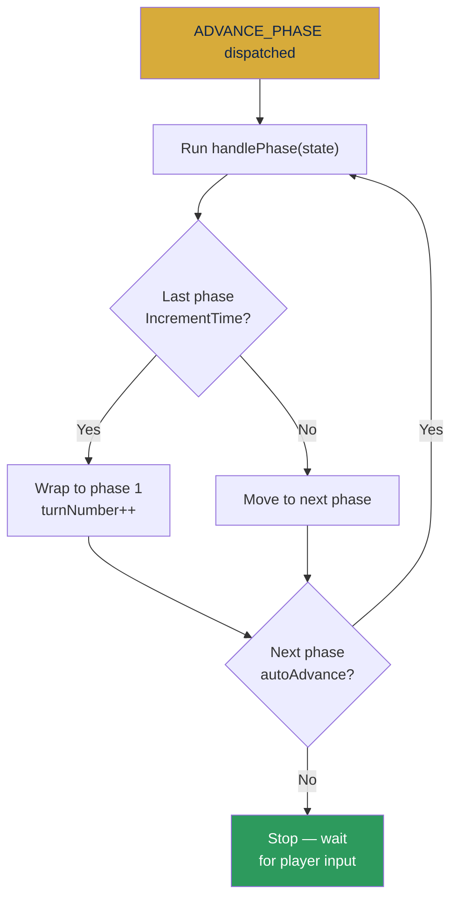

This means one click skips past all non-interactive phases (e.g., InitializeState → ReviewResources → SetManningSchedule → EstimateNeeds → BuildTimetable all resolve in one click, stopping at InterpretATO).

---

## 5. 14-Phase Turn Sequence

Defined in `src/data/config/phases.ts`, handlers in `src/core/phases.ts`.

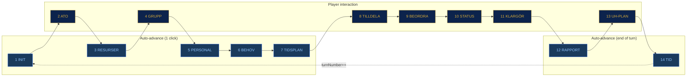

| # | Phase | Auto? | What Happens |
|---|-------|-------|-------------|
| 1 | **InitializeState** | Yes | Logs "Varv N startar" event |
| 2 | **InterpretATO** | No | Checks pending orders for unmet requirements |
| 3 | **ReviewResources** | Yes | Scans all bases for low fuel/parts/ammo, logs warnings |
| 4 | **ChooseGroupingStrategy** | No | Player repositions aircraft (pass-through) |
| 5 | **SetManningSchedule** | Yes | Personnel scheduling (pass-through) |
| 6 | **EstimateNeeds** | Yes | Resource estimation (pass-through) |
| 7 | **BuildTimetable** | Yes | Timetable generation (pass-through) |
| 8 | **AllocateAircraft** | No | Player assigns aircraft to ATO orders |
| 9 | **OrderPreparation** | No | Player dispatches orders |
| 10 | **PrepareStatusCards** | No | Generates recommendations |
| 11 | **ExecutePreparation** | No | Random failure rolls on MC aircraft |
| 12 | **ReportOutcome** | Yes | Logs MC rate and mission stats |
| 13 | **UpdateMaintenancePlan** | No | Decrements repair timers, completes repairs |
| 14 | **IncrementTime** | Yes | Advances clock +1h, fuel drain, day rollover, new ATO |

After phase 14, the cycle wraps to phase 1 and `turnNumber` increments.

### Phase Handler Details

**InterpretATO**: For each pending ATO order, checks if the launch base has enough MC aircraft of the required type. Logs a warning event for each unmet order.

**ReviewResources**: Scans all bases:
- Fuel < 20% → critical event
- Spare part quantity = 0 → critical event
- Ammo < 20% of max → warning event

**PrepareStatusCards**: Calls `generateRecommendations(state)` and sets `state.recommendations`.

**ExecutePreparation**: For each `ready` aircraft across all bases, rolls `rollRandomFailure()` (5% chance). On failure, rolls `rollFailureType()` to determine maintenance type and time, transitions aircraft to `unavailable`.

**UpdateMaintenancePlan**: For each `under_maintenance` aircraft with `maintenanceTimeRemaining`:
- Decrements by 1
- If remaining <= 0, transitions to `ready` and logs success event
- Updates `maintenanceBays.occupied` count

**IncrementTime**:
- Advances hour by 1
- If hour >= 24, rolls to next day (hour resets to 6)
- Updates `phase` from scenario config (`getPhaseForDay`)
- Applies fuel drain (0.5/1.5/3.0% per hour by phase)
- On day rollover, generates new ATO orders via `generateATOOrders()`
- Marks dispatched orders as completed if past their end hour

---

## 6. Stochastics & Dice Tables

Defined in `src/data/config/probabilities.ts`, functions in `src/core/stochastics.ts`.

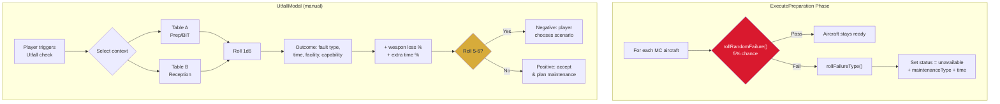

### Random Failure (per turn)

- **Base rate**: 5% (1 in 20) per MC aircraft per turn
- **Failure types**: weighted random selection

| Type | Weight | Repair Time |
|------|--------|------------|
| quick_lru | 2 | 2h |
| complex_lru | 1 | 6h |
| direct_repair | 1 | 16h |
| troubleshooting | 2 | 4h |

### Utfall Dice Tables

Two contexts from the SAAB simulation deck, each with 6 outcomes on a d6 roll:

**Table A — Prep/Startup BIT** (loading, fueling, startup):

| Roll | Fault | Time | Facility | Capability |
|------|-------|------|----------|-----------|
| 1 | Quick LRU | 2h | Service bay | AU Steg 1 |
| 2 | Quick LRU | 2h | Service bay | AU Steg 1 |
| 3 | Complex LRU | 6h | Minor workshop | AU Steg 2/3 |
| 4 | Direct repair | 16h | Major workshop | AU Steg 4 |
| 5 | Troubleshooting | 4h | Service bay | FK Steg 1-3 |
| 6 | Troubleshooting | 4h | Minor workshop | Kompositrep |

**Table B — Reception/Post-mission**:

| Roll | Fault | Time | Facility | Capability |
|------|-------|------|----------|-----------|
| 1 | Quick LRU | 2h | Service bay | Hjulbyte |
| 2 | Quick LRU | 2h | Service bay | AU Steg 1 |
| 3 | Direct repair | 6h | Minor workshop | FK Steg 1-3 |
| 4 | Troubleshooting | 16h | Major workshop | AU Steg 4 |
| 5 | Complex LRU | 4h | Minor workshop | AU Steg 2/3 |
| 6 | Troubleshooting | 4h | Service bay | FK Steg 1-3 |

**Weapon loss by roll**: 10%, 30%, 50%, 70%, 90%, 100%

**Extra maintenance time by roll**: 0%, 0%, 0%, +10%, +20%, +50%

### Seeded RNG

```typescript
const rng = createRng(42)  // Deterministic
rng.roll(6)                // [1, 6]
rng.chance(0.05)           // true/false
```

Use for testing and replay. Production code uses `Math.random()` via `rollDice()`.

---

## 7. Recommendation Engine

`src/core/recommendations.ts` generates actionable suggestions during the PrepareStatusCards phase.

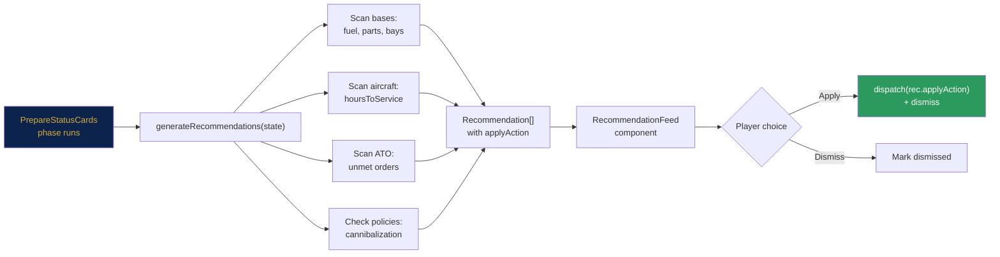

### Triggers

| Condition | Type | Priority |
|-----------|------|----------|
| Fuel < 30% | warning | high/critical |
| Spare parts <= 1 | resupply | high |
| `hoursToService` <= 10 | maintenance | high/critical |
| Maintenance bays full + aircraft waiting | rebalance | high |
| Pending ATO order with insufficient MC aircraft | reassign | high |
| Cannibalization forbidden (day 7) | warning | medium |

### Recommendation Structure

Each recommendation includes:
- **title** and **explanation** for display
- **applyAction**: a `GameAction` that executes the recommendation
- **tradeoff**: what the player gives up
- **priority**: critical > high > medium > low

The `APPLY_RECOMMENDATION` action recursively calls `gameReducer` with the recommendation's `applyAction`, then marks it as dismissed.

---

## 8. Configuration Data

All in `src/data/config/`.

### `phases.ts` — Phase Definitions

14 entries with `id`, `label`, `shortLabel`, `description`, `allowedActions[]`, `autoAdvance`, and optional `buttonLabel`.

### `scenario.ts` — 7-Day Campaign

```mermaid
gantt
    title 7-Day Campaign Scenario
    dateFormat X
    axisFormat Day %s

    section Phase
    FRED           :fred, 1, 2
    KRIS           :kris, 2, 5
    KRIG           :crit, krig, 5, 8

    section Threats
    CM Attack      :crit, cm, 4, 5
    TBM Risk       :crit, tbm, 5, 6

    section Policy
    No Cannibalization :active, policy, 7, 8
```

### `probabilities.ts` — Dice Tables

Utfall tables A & B, weapon loss, extra maintenance time, failure rates, service intervals (A=5d, B=8d, C=20d).

### `durations.ts` — Time Values

Per aircraft type: prep time (30-60 min), recovery time (20-45 min), fuel loading (10-25 min), ammo loading (0-25 min).

UE cycle: base-to-RESMAT 5 days, MRO loop 30 days, cannibalization 1 hour.

Service interval: 100 flight hours. Prep lead time: 1 hour before takeoff.

### `capacities.ts` — Zone & Personnel

Zone capacities by base type (huvudbas/sidobas/reservbas). Personnel requirements by action type. Facility capability matrices. Fuel drain rates by scenario phase.

---

## 9. Initial Game State & Scenario

`src/data/initialGameState.ts`

### Fleet

| Base | Aircraft |
|------|----------|
| MOB (Huvudbas) | 18x GripenE, 6x GripenF_EA, 2x GlobalEye, 4x VLO_UCAV, 2x LOTUS |
| FOB_N (Sidobas) | 12x GripenE, 2x LOTUS |
| FOB_S (Sidobas) | 6x GripenF_EA |

### Resources

| Resource | MOB | FOB_N | FOB_S |
|----------|-----|-------|-------|
| Fuel | 95% | 80% | 70% |
| Maintenance bays | 4 | 2 | 1 |
| IRIS-T | 24/32 | 16/20 | 8/12 |
| Meteor | 12/16 | 8/10 | 6/8 |
| GBU-39 | 16/24 | 8/12 | — |
| RBS-15F | 6/8 | — | — |

### ATO Generation

`generateATOOrders(day, phase)` creates the daily mission set:

- **All phases**: QRA (2x GripenE, H24, MOB)
- **FRED**: + RECCE (2x GripenE, 08-12, FOB_N)
- **KRIS**: + DCA (4x GripenE, 06-14, MOB), AEW (1x GlobalEye, 06-18, MOB), RECCE
- **KRIG**: + DCA x2 (6+6 GripenE), AI_DT (4x GripenE), RECCE, ESCORT (2x GripenF_EA)

---

## 10. State Management & Hooks

### GameContext (`src/context/GameContext.tsx`)

```typescript
// In App.tsx:
<GameProvider>
  <BrowserRouter>...</BrowserRouter>
</GameProvider>

// In any component:
const { state, advanceTurn, dispatch, ... } = useGame();
```

### useGameEngine API (`src/hooks/useGameEngine.ts`)

Returns a `GameEngine` object with:

| Method | Description |
|--------|------------|
| `state` | Current `GameState` |
| `dispatch(action)` | Raw action dispatch |
| `advanceTurn()` | `ADVANCE_PHASE` |
| `resetGame()` | `RESET_GAME` |
| `assignAircraftToOrder(orderId, ids)` | `ASSIGN_AIRCRAFT` |
| `dispatchOrder(orderId)` | `DISPATCH_ORDER` |
| `startMaintenance(baseId, acId)` | `START_MAINTENANCE` |
| `moveAircraftToMaintenance(baseId, acId)` | `START_MAINTENANCE` |
| `sendOnMission(baseId, acId, mission)` | `SEND_MISSION_DROP` |
| `sendMissionDrop(baseId, acId, type?)` | `SEND_MISSION_DROP` |
| `applyUtfallOutcome(...)` | `APPLY_UTFALL_OUTCOME` |
| `createATOOrder(order)` | `CREATE_ATO_ORDER` |
| `editATOOrder(id, updates)` | `EDIT_ATO_ORDER` |
| `deleteATOOrder(id)` | `DELETE_ATO_ORDER` |
| `applyRecommendation(id)` | `APPLY_RECOMMENDATION` |
| `dismissRecommendation(id)` | `DISMISS_RECOMMENDATION` |
| `getResourceSummary()` | Formatted text report |

---

## 11. Pages & Routing

| Route | Page | Purpose |
|-------|------|---------|
| `/` | `Index.tsx` | Main dashboard — base map, KPIs, phase tracker, pipeline, Gantt, recommendations |
| `/ato` | `ATO.tsx` | ATO order list + aircraft assignment panel + create/edit/delete |
| `/map` | `Map.tsx` | Tactical SVG map of Sweden with base markers, supply lines, fleet overlay |

All pages use `useGame()` for shared state. Navigation is in the `TopBar`.

---

## 12. Component Reference

### Dashboard Page Component Tree

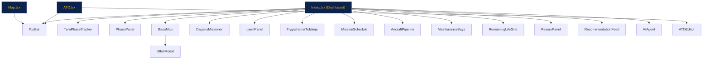

### Game Components (`src/components/game/`)

| Component | Purpose |
|-----------|---------|
| `TopBar` | Header with nav, time/phase display, MC rate, advance button |
| `TurnPhaseTracker` | 14-step phase progress bar with current phase highlight |
| `PhasePanel` | Context-sensitive panel: resource review, allocation summary, execution results |
| `BaseMap` | SVG airbase layout with drag-drop aircraft, zone highlights, UtfallModal |
| `AircraftPipeline` | 4-column flow: MC → On Mission → NMC → Maintenance |
| `MissionSchedule` | Gantt-style timeline reading from `state.atoOrders` |
| `ATOEditor` | Modal form for create/edit ATO orders |
| `RecommendationFeed` | Recommendation cards with Apply/Dismiss |
| `StatusBadge` | Colored badge for all 9 aircraft states + phase badge |
| `GanttBar` | Reusable positioned timeline bar |
| `UtfallModal` | Dice-roll modal with dual tables (prep/reception), decision panel |
| `MaintenanceBays` | Visual maintenance slot display |
| `FleetGrid` | Aircraft list grouped by status |
| `AIAgent` | Chat-style AI assistant with resource summary |

### Dashboard Components (`src/components/dashboard/`)

| Component | Purpose |
|-----------|---------|
| `StatusKort` | KPI card (count + subtitle + icon) |
| `LarmPanel` | Event log panel |
| `DagensMissioner` | Today's ATO missions display |
| `FlygschemaTidslinje` | Flight schedule timeline per aircraft |
| `ResursPanel` | Fuel, ammo, parts, personnel summary |
| `RemainingLifeGraf` | Service interval bars |
| `SpelprocessFlode` | Static game flow diagram |

### BaseMap Interaction Model

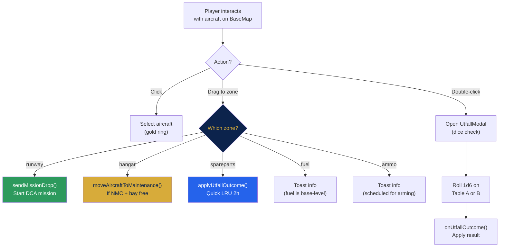

The BaseMap uses SVG pointer events (not HTML5 drag API). Zone detection is bounding box hit test against `SVG_ZONES`.

---

## 13. Design System

### SAAB Color Palette

| Token | HSL | Hex | Usage |
|-------|-----|-----|-------|
| Navy | `hsl(220 63% 18%)` | `#0C234C` | Headers, backgrounds |
| Gold | `hsl(42 64% 53%)` | `#D7AB3A` | Accents, active elements |
| Red | `hsl(353 74% 47%)` | `#D9192E` | Errors, critical |
| Green | `hsl(152 60% 32%)` | `#2D9A5D` | Success, MC |
| Silver | `hsl(200 12% 86%)` | — | Text, borders |

### CSS Variables

```css
--gradient-navy: linear-gradient(135deg, hsl(220 63% 14%), hsl(220 63% 22%))
--gradient-gold: linear-gradient(135deg, hsl(42 64% 48%), hsl(42 64% 58%))
```

### Component Styling Patterns

- Tailwind utility classes for layout and spacing
- Inline `style={{}}` for SAAB theme colors (HSL values)
- `font-mono` for data values, `font-sans` for labels
- Text sizes: `text-[9px]` for micro labels, `text-[10px]` for data, `text-xs` for body

---

## 14. Domain Concepts

### Airbase Model

Aircraft are **not part of the airbase** — they are external mission assets the base services. The simulation models base operations: fueling, arming, maintenance, personnel management.

### Decision Roles

| Role | Responsibility |
|------|---------------|
| AOC | Air Operations Center — issues ATO |
| Basbat chef | Base commander — overall allocation |
| UH-beredningsfunktion | Maintenance planning |
| UH/klargöringsfunktion | Maintenance + prep execution |
| Klargöringstroppar | Prep teams on the flight line |

### Resource Cycles

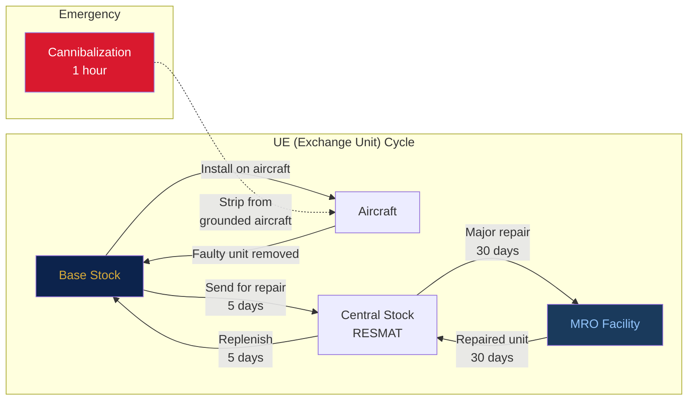

- **UE (Exchange Units)**: Base stock ↔ RESMAT (5 days) ↔ MRO (30 days). Cannibalization = 1 hour.
- **Spare Parts**: 8 types with lead times from 3 to 30 days.
- **Fuel**: Drains continuously, faster in KRIG.
- **Personnel**: 5 roles, shift-based availability.

### Success Metrics

- MC rate (% of fleet mission-capable)
- Missions completed
- Resource utilization
- Maintenance queue depth
- Service interval margin

---

## 15. How-To Guides

### Add a New Aircraft Status

1. Add to `AircraftStatus` union in `src/types/game.ts`
2. Update `displayStatusCategory()`, `isMissionCapable()`, `isInMaintenance()` if needed
3. Add entry in `StatusBadge.tsx` `statusConfig`
4. Add to `AC_COLOR` and `AC_LABEL` in `BaseMap.tsx`
5. Add to `statusMap` in `Map.tsx` `AircraftDetail`
6. Update `ApronDetail` groups array in `BaseMap.tsx`
7. Add to `statusLabels` in `BaseMap.tsx` `AircraftDetail`

### Add a New Phase Handler

1. Create handler function in `src/core/phases.ts`:
   ```typescript
   function handleMyPhase(state: GameState): GameState {
     // ... logic
     return addEvent(state, { type: "info", message: "..." });
   }
   ```
2. Add case in `handlePhase()` switch
3. If adding a new phase entirely, add to `TurnPhase` union in `types/game.ts`
4. Add definition in `src/data/config/phases.ts` with `autoAdvance` flag
5. If player-driven, add UI section in `PhasePanel.tsx`

### Add a New Game Action

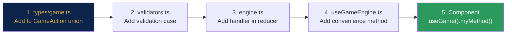

1. Add variant to `GameAction` union in `src/types/game.ts`
2. Add validation in `validateAction()` in `src/core/validators.ts`
3. Add handler case in `gameReducer()` in `src/core/engine.ts`
4. Add convenience method in `GameEngine` interface and `useGameEngine.ts`
5. Call from component via `useGame().myNewMethod()`

### Add a New Recommendation Type

1. Add trigger condition in `generateRecommendations()` in `src/core/recommendations.ts`
2. Set `applyAction` to a valid `GameAction` that resolves the recommendation
3. Set appropriate `type` and `priority`
4. The `RecommendationFeed` component handles display automatically

### Add a New Config Table

1. Create typed file in `src/data/config/`
2. Export constants and helper functions
3. Import in engine code (`src/core/`) or components as needed
4. Keep config files pure data — no React, no side effects

### Add a New Base

1. Create base object in `src/data/initialGameState.ts` following the `Base` interface
2. Add to the `bases` array in `initialGameState`
3. Add position in `BASE_POSITIONS` in `Map.tsx`
4. Add supply line connections in `SUPPLY_LINES` in `Map.tsx`
5. Add as option in `ATOEditor.tsx` `BASES` array

### Tune Game Balance

All balance levers are in `src/data/config/`:

| Want to change... | Edit... |
|-------------------|---------|
| Failure rates | `probabilities.ts` → `BASE_FAILURE_RATE`, `FAILURE_TYPE_WEIGHTS` |
| Repair times | `durations.ts` → `MAINTENANCE_TIMES` |
| Fuel consumption | `capacities.ts` → `FUEL_DRAIN_RATE` |
| Prep/recovery speed | `durations.ts` → `PREP_TIME`, `RECOVERY_TIME` |
| Mission demand | `initialGameState.ts` → `generateATOOrders()` |
| Scenario pacing | `scenario.ts` → `SCENARIO_DAYS` |
| Dice outcomes | `probabilities.ts` → `UTFALL_TABLE_A`, `UTFALL_TABLE_B` |

---

## 16. File Map

```
src/
├── App.tsx                          # Root: providers + routing
├── context/
│   └── GameContext.tsx               # Shared state provider + useGame() hook
├── hooks/
│   └── useGameEngine.ts             # Reducer wrapper + convenience API
├── types/
│   └── game.ts                      # All type definitions (single source of truth)
├── core/                            # Pure game logic (no React)
│   ├── engine.ts                    #   Main reducer: gameReducer()
│   ├── phases.ts                    #   14 phase handlers
│   ├── stochastics.ts               #   RNG, dice tables, failure rolls
│   ├── recommendations.ts           #   Recommendation generator
│   ├── validators.ts                #   Action validation
│   └── index.ts                     #   Barrel exports
├── data/
│   ├── initialGameState.ts          # Starting state + ATO generator
│   └── config/
│       ├── phases.ts                #   Phase definitions (14 entries)
│       ├── scenario.ts              #   7-day campaign config
│       ├── probabilities.ts         #   Utfall tables, failure rates
│       ├── durations.ts             #   Time values per aircraft/action
│       └── capacities.ts            #   Zone caps, personnel, fuel drain
├── pages/
│   ├── Index.tsx                    # Dashboard (base map, KPIs, timeline)
│   ├── ATO.tsx                      # ATO orders + aircraft assignment
│   ├── Map.tsx                      # Tactical map of Sweden
│   └── NotFound.tsx
├── components/
│   ├── game/                        # Game-specific UI (20 components)
│   │   ├── TopBar.tsx
│   │   ├── TurnPhaseTracker.tsx
│   │   ├── PhasePanel.tsx
│   │   ├── BaseMap.tsx              #   800+ lines, SVG drag-drop
│   │   ├── ATOEditor.tsx
│   │   ├── RecommendationFeed.tsx
│   │   ├── MissionSchedule.tsx
│   │   ├── AircraftPipeline.tsx
│   │   ├── StatusBadge.tsx
│   │   ├── UtfallModal.tsx
│   │   ├── GanttBar.tsx
│   │   └── ...
│   ├── dashboard/                   # Dashboard widgets (7 components)
│   │   ├── StatusKort.tsx
│   │   ├── LarmPanel.tsx
│   │   ├── ResursPanel.tsx
│   │   └── ...
│   └── ui/                          # shadcn/ui primitives (30+ components)
└── lib/
    └── utils.ts                     # cn() classname helper
```
